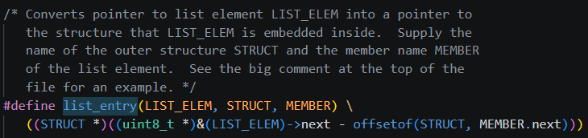
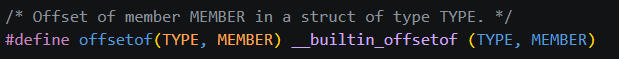

- offsetof
  - 실제 현재 struct thread 주소 기준
  - elem 멤버가 몇 바이트 뒤에 있나?를 구하는 것

- \_\_builtin_offsetof(struct foo, e)
  - 컴파일러가 직접 계산해주는 내장 연산

1. LIST_ELEM : &t->elem 같은 포인터
2. &(LIST_ELEM)->next : &t->elem.next 주소
3. offsetof(STRUCT, MEMBER.next)는 STRUCT 시작점에서 elem.next 까지 거리
4. 그 거리를 빼면 다시 t의 시작 주소가 됨
