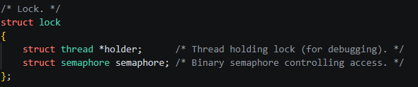
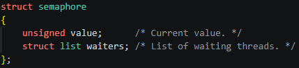
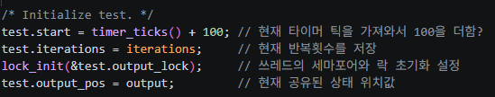
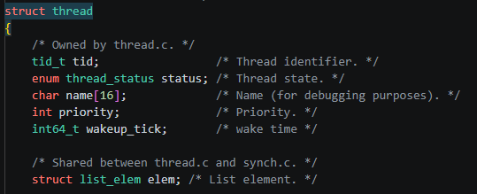
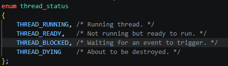

# 락과 세마포어



# 스레드



# 리스트들과의 흐름 관계



1. 락/세마포어 때문에 막힘

- RUNNING
- waiters에 들어감
- BLOCKED
- thread_unblock()되면 ready_list로 이동
- 나중에 스케줄되면 RUNNING

2. timer_sleep() 때문에 잠듬

- RUNNING
- sleep_list에 들어감
- BLOCKED
- 시간이 되어서 thread_unblock()되면 ready_list로 이동
- 나중에 스케줄되면 RUNNING

> 락/세마포어 때문에 막히는 경우 예시
>
> > 어떤 스레드 A가 이미 L* 락을 들고있고  
> > 스레드 B가 같은 L* 락에 대해 lock_acquire()을 호출할 경우

> 두 스레드가 같은 output_pos를 동시에 수정하려 할 때

> 파일 시스템의 shared metadata를 동시에 바꾸려 할 때

> ready queue, sleep queue 같은 공유 자료구조를 보호할 때

# 매번 인터럽트를 끄는 이유

```
핵심은 원자성

Pintos는 단일 CPU 기준 -> timer interrupt만 끼어들지 않는다면 그 짧은 구간은 사실상 끊기지 않고 한 번에 실행

중간에 timer interrupt가 끼어들어 shared data를 같이 만지지 못하게 하려고
check와 update 사이가 끊겨 race condition이 나는걸 막기 위해
* race_condition
    - 여러 스레드(또는 프로세스)가 동시에 같은 데이터를 건드릴 때, 실행 순서에 따라 결과가 달라지는 문제
스레드 상태 전이와 리스트 조작을 한 덩어리로 처리하기 위해
```

# 인터럽트와 락의 차이

- 인터럽트 off

```
목적
timer_interrupt() 같은 인터럽트 핸들러가 중간에 끼어들지 못하게 해, 아주 짧은 구간을 원자적으로 처리하려는 것
Pintos는 단일 CPU라서 인터럽트를 끄면 그 CPU에서 preemption/context switch도 사실상 막혀 다른 스레드가 실행할 기회도 없어짐

- thread 상태 바꾸기
- ready_list, sleep_list, waiters 같은 커널 리스트 조작
- ticks 같은 인터럽트 공유 값 처리
```

- 락

```
목적
인터럽트와 별개로, 여러 스레드가 같은 공유 자원에 동시에 들어오지 못하게 하는 것
즉, 하나의 스레드의 작동을 하기 위한 것이기 보다 한 시점에 한 스레드만 그 자원/임계구역을 사용하게 하려는 것

락을 못 얻으면 그 스레드는 waiters에서 잠들고, 다른 스레드는 계속 실행될 수 있음
```

- 인터럽트와 락 정리

```
인터럽트 off는 인터럽트 핸들러와 스케줄러 개입을 막아서 현재 CPU에서 끊기지 않게 만드는 것

락은 인터럽트를 끄지 않아도 되고 오히려 못 얻으면 잠들 수 있는 고수준 동기화 수단
```

# 메인 스레드 흐름

```
main test thread
  -> thread_create(..., alarm_priority_thread, NULL)
  -> 새 struct thread 생성
  -> t->tf에 "미래의 CPU 상태" 기록
  -> ready_list에 넣음
  -> 언젠가 schedule()이 이 스레드를 선택
  -> thread_launch(next)
  -> do_iret(&next->tf)
  -> CPU 레지스터가 tf 값으로 복원됨
  -> RIP = kernel_thread
  -> kernel_thread(function, aux) 실행
  -> kernel_thread(alarm_priority_thread, NULL)
  -> alarm_priority_thread(NULL) 실행 시작
```

- tf

```
tf는 이 스레드가 다시 CPU를 받을 때 복원할 레지스터 스냅샷
새 스레드는 아직 한 번도 실행된 적이 없으니, Pintos가 그 스냅샷을 미리 만들어 둠

t->tf.rip = (uintptr_t)kernel_thread;
t->tf.R.rdi = (uint64_t)function;
t->tf.R.rsi = (uint64_t)aux;

rip = kernel_thread
-> 이 스레드가 처음 시작하면 kernel_thread부터 시작하라
rdi = function
-> x86-64에서 첫 번째 인자
rsi = aux
-> 두 번째 인자

그래서 CPU가 이 tf를 복원하면 실제로는
kernel_thread(function, aux)

그리고 kernel_thread() 안에서
function(aux); 가 실행
```
