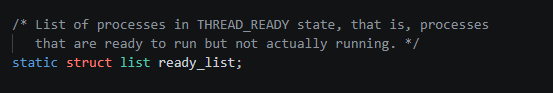

- thread.c
  

```
왜 ready_list와 semaphore.waiters, sleep_list를 같이 못쓸까

ready_list
- 당장 실행 가능하지만 CPU를 아직 못 받은 스레드들의 큐
- 스레드 상태 : THREAD_READY

semaphore.waiters
- semaphore를 얻지 못해서 막혀 있는 스레드들의 큐
- 스레드 상태 : TRHEAD_BLOCKED

ready_list가 없으면 "실행 가능한 스레드들을 어디에 모아둘지"가 없음
waiters가 없으면 "락/세마포어 때문에 잠든 스레드들을 어디에 재울지"가 없음


운영체제는 원래 둘 다 관리
- 실행 가능한 스레드 집합
- 어떤 이벤트/자원을 기다리는 스레드 집합

thread의 elem은
run queue, semaphore waite list의 원소로도 쓰이지만, 동시에 둘 다로는 못 씀
-> 하나의 리스트 노드는 한 순간에 하나의 리스트에만 속할 수 있다.

-> 자료구조 invariant가 깨짐
    - 같은 element이 두 리스트에 동시에 연결될 수 없음
-> 상태 invariant가 깨짐
    - 한 스레드는 동시에 READY이면서 BLOCKED일 수 없음
```
