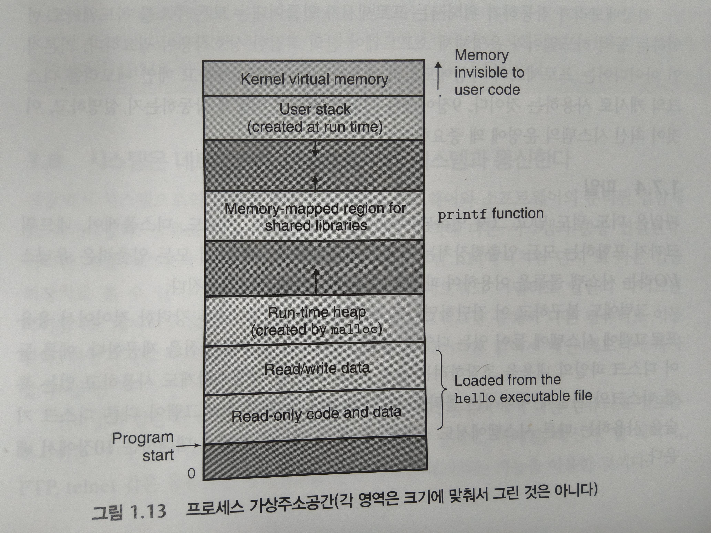

# 모르는 개념 정리

## 전형적인 시스템의 하드웨어 구성(인텔기준이라고 함)

### 버스(Buses)

### 입출력장치

### 메인메모리

### 프로세서

#### - (ALU 연산장치)

#### - (CPU 작동방식)

```
적재(Load) : 메인 메모리에서 레지스터에 한 바이트 또는 워드를 이전 값에 덮어쓰는 방식으로 복사한다.

저장(Store) : 레지스터에서 메인 메모리로 한 바이트 또는 워드를 이전 값을 덮어쓰는 방식으로 복사한다.

작업(Operate) : 두 레지스터의 값을 ALU로 복사하고 두 개의 워드로 수식연산을 수행한 뒤, 결과를 덮어쓰기 방식으로 레지스터에 저장한다.

점프(Jump) : 인스트럭션 자신으로부터 한 개의 워드를 추출하고, 이것을 PC에 덮어쓰기 방식으로 복사한다.
```

### 운영체제

```
1. 프로세스

context switching
-> 문맥 전환

PC, 레지스터 파일, 메인 메모리의 현재값을 포함하고 있다.

현재 프로세스에서 다른 새로운 프로세스로 제어를 옮기려고 할 경우
현재 프로세스의 컨텍스트를 저장하고 새 프로세스의 컨텍스트를 복원하는 '문맥전환'

쉘은 시스템콜이라는 특수 함수를 호출하여 운영체제로 제어권을 넘겨줌
운영체제는 쉘의 컨텍스트를 저장하고 새로운 hello 프로세스와 컨텍스트를 생성한 뒤 제어권을 새 hello 프로세스로 넘겨준다.
hello가 종료되면 운영체제는 쉘 프로세스의 컨텍스트를 복구시키고 제어권을 넘겨주면서 다음 명령 줄 입력을 기다린다.
```

```
2. 쓰레드

각각의 쓰레드는 해당 프로세스의 컨텍스트에서 실행되며 동일한 코드와 전역 데이터를 공유한다.
```

```
3. 가상메모리

- 각 프로세스들이 메인 메모리 전체를 독립적으로 사용하고 있는 것 같은 환상을 제공해주는 추상화
- 주소공간의 최상의 영역은 모든 프로세스들이 공통으로 사용하는 운영체제의 코드와 데이터를 위한 공간
- 주소공간의 하위 영역은 사용자 프로세스의 코드와 데이터를 저장
- 그림에서 위쪽으로 갈 수록 주소가 증가

```



4. Amdahl의 법칙

```
T(new) = (1-알파)T(old) + (알파T(old))/k
= T(old)[(1-알파) + 알파/k]

-> T(old) / T(new) = 1/[(1-알파) + 알파/k]
```
